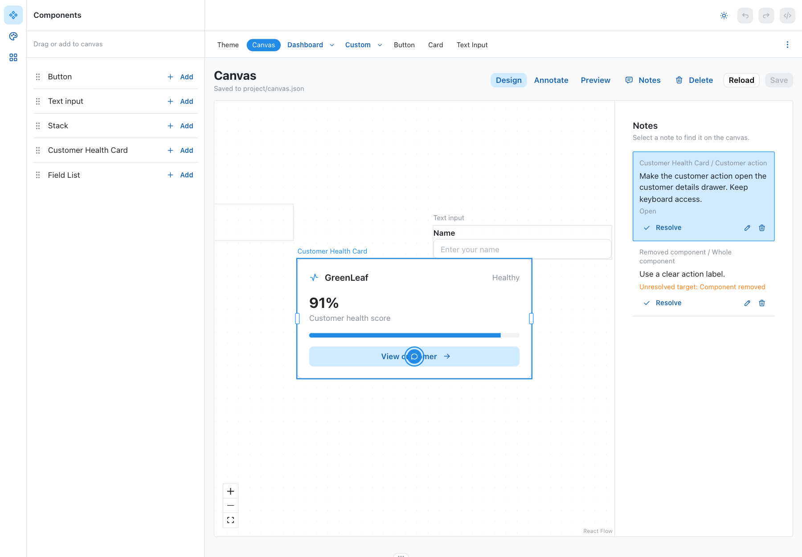

# Free-positioned canvas and annotations

Status: implemented and browser-verified, ready for Isaac's review.

## Use

Open http://localhost:4200/canvas in the existing Texo shell.

- Design: drop real components at the pointer, drag them freely, resize their width, pan/zoom or Fit View. Selected nodes also move with arrow keys. Delete removes a component without deleting its notes.
- Annotate: click a component to place a note. The Customer Health Card additionally exposes its action button as a named internal target. Other named targets can be declared through the existing registry's optional targets metadata; notes store the key, never arbitrary selectors or fixture indexes.
- Notes: focus a target, edit a note, resolve/reopen it or delete it. Missing components and missing/ambiguous named targets are visibly unresolved, independent of completion status.
- Save: persist components, positions, widths, UUIDs and notes to project/canvas.json. Saving is explicit, not automatic. Reload asks before discarding local changes. Clean external file changes update the editor; conflicting changes preserve the local canvas and require explicit Reload.
- Preview: interact with the same real components. Pins, notes panel, resize handles and viewport controls disappear; component clicks, typing and scrolling are not intercepted.

The saved project starts empty. Verification fixtures were removed using revision-checked writes; the screenshot below records the exercised example rather than seeding user tasks.

## Decisions and boundaries

Isaac approved free-positioned components (A), moving annotations ahead of the old gate order. React Flow 12.11.6 is an editor-only dev dependency. Existing TexoAppShell, library, theme and routes remain.

The page document separates authoring positions from the future responsive composition contract. No frames-only restriction, property inspector, nested layout rules, Prototype connections, page undo, agent execution or collaboration accounts were added.

The production entry uses a separate real-component renderer with the saved spatial arrangement. Its virtual document contains only instances. React Flow, annotation UI, named editor-target metadata and note bodies are absent from browser assets. The existing Texo shell remains; this is not yet the later standalone application/navigation gate.

The file bridge is local and dev-only: fixed path, versioned validation, 1 MB cap, same-origin/header checks, SHA revisions, serialized saves, temporary-file rename and a final external-change recheck. Noncooperating disk writers can still race the tiny last-read-to-rename interval; this is not a cross-process transaction lock.

## Evidence

- Native drops of Button, Text input and Customer Health Card matched pointer coordinates within one CSS pixel. Repeated after zoom to 0.833333 and a pan: Stack dropped at x435/y340 versus pointer x435/y340.59.
- Moving the card changed its saved position from x100/y359.40625 to x256/y259.40625. Its action pin moved by the same +156/-100 delta.
- Native width resize changed the card from 320 to 420; saved width survived browser reload.
- Created a semantic action note and a whole-button note through pointer/keyboard authoring. Edited the action note, resolved it, saved it, reopened it and saved again. Reload retained UUIDs and both pins.
- Selecting the action note centered its component. Deleting the annotated button retained the note and displayed Unresolved target: Component removed.
- Preview typed `Preview remains interactive`, delivered one native action-button click, and exposed zero pins, notes panels, React Flow controls or inert component regions.
- Keyboard movement changed saved x199 to x204. Pointer movement also persisted through final position-change events.
- Invalid width PUT returned 400; stale revision PUT returned 409; missing editor authorization header returned 403. All preserved the file revision.
- Dirty local insertion plus external file edit produced a visible conflict and disabled Save while retaining four local nodes. Confirmed Reload discarded the local insertion and loaded the external note change. A subsequent clean external edit updated the panel without reloading the app.
- Temporarily invalid on-disk instances produced 422 and actionable diagnostics while retaining three last-valid rendered nodes. Restoring the exact file cleared the error. Temporary data was then removed.
- `./node_modules/.bin/vite build`: passes. Existing Nx deprecation/large-bundle warnings remain, plus warnings about a future native Vite config loader; no warning suppression added.
- `./node_modules/.bin/tsc -p tsconfig.app.json --noEmit`: same six baseline diagnostics in five files established in the preceding checkpoint. No new diagnostics.
- Production preview on temporary port 4310 rendered the saved real components and accepted `Production input works`; zero React Flow nodes and annotation surfaces. Browser-asset search found no React Flow classes, editor API paths, annotation UI identifiers or saved note bodies. Package metadata lists React Flow only as a dev dependency.
- No project-wide test suite run. Native browser gestures, direct file API scenarios, production runtime and compilation were the verification paths. The temporary production server was stopped; the existing 4200 server remains.

## Bugs found during verification

- React Flow's initial fitView moved the first empty-canvas drop away from its pointer. Fit-on-load now runs only for an initially populated file, not the first insertion.
- React Flow disables wrapper pointer events when nodes are neither selectable nor draggable. Preview now explicitly retains pointer events while disabling editor behavior.
- Pointer drag-stop alone missed keyboard movement. Final position changes now persist both input paths.

## Ownership

CanvasFiles: schema, hook and file bridge. CanvasNotes: annotation surface/pins and task list. CanvasFreeform: React Flow composition and shell-facing exports. Main: shared registry metadata, dependencies, dev/production separation, integration fixes and end-to-end verification.

