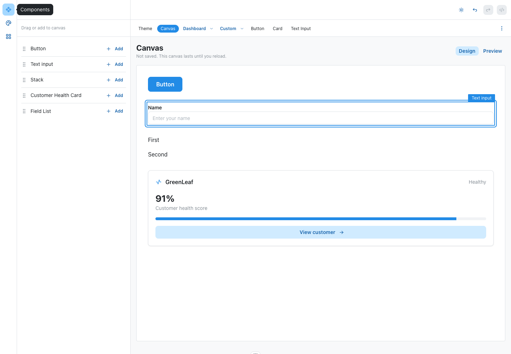

# Integrated canvas, stage 1

Status: implemented and browser-verified; awaiting Isaac's hands-on review.

## For Isaac

Open http://localhost:4200/canvas in the existing Texo app. Drag Button, Text input or Stack from the Components rail onto the page. Select an instance in Design; switch to Preview to type and click. Add buttons also support keyboard insertion.

This is the first approved gate, not the complete visual builder. The canvas is in memory and resets on reload. File-backed pages, property editing, movement/resizing, Prototype connectors and canvas undo are subsequent gated stages. Existing undo/redo remains theme-only and is labeled accordingly.

## Implementation

- `src/app/app.tsx`: Canvas route and Components rail inside the existing TexoAppShell. Existing theme, gallery, custom components and dashboard routes preserved. CanvasProvider stays mounted across route changes. Component code panel is disabled on Canvas rather than showing misleading generated code.
- `src/app/canvas-page.tsx` and `.module.css`: registry-driven library, native HTML drag/drop, UUID instances, responsive vertical page flow, selection overlay, inert Design content and interactive Preview. Mode switching preserves mounted input state. Unknown drag IDs are rejected.
- `src/extensions/base-components.tsx`: existing BaseButton, BaseTextInput and BaseStack registered with the established defineTexoComponent API. Stack uses two real text children to demonstrate layout; arbitrary nesting belongs to the manipulation gate.
- `src/extensions/registry.ts`: componentLibrary combines those primitives with existing projectComponents. Custom gallery retains its two original definitions. No new registry contract or dependencies.
- Ownership: CanvasRegistry implemented registrations; CanvasSurface implemented the canvas module/styles; Main integrated the shell and verified the live app.

## Verification

Browser: Chromium at http://localhost:4200, using the existing Vite process rooted in work/texo-ui. No replacement server or port introduced.

- PASS: native pointer drag/drop from Button, Text input and Stack library rows produced exactly 1, 2 and 3 instances respectively. Each insertion selected the new instance.
- PASS: clicking the input in Design selected it; typing left its value empty. Content was inert.
- PASS: Preview typing yielded `Isaac canvas smoke`. A temporary native click listener on the real button received one click. No selection overlays or inert content remained. Library insertion was disabled.
- PASS: returning to Design preserved the input value and selected instance.
- PASS: global color-scheme toggle changed the page, input and button. Page light/dark backgrounds were rgb(255,255,255)/rgb(26,27,30); button backgrounds were rgb(34,139,230)/rgb(25,113,194).
- PASS: existing Card, Theme, Dashboard and Custom routes opened through shell navigation. Custom gallery retained two entries; global theme controls remained accessible.
- PASS: returning to Canvas retained the same three UUIDs. Keyboard insertion added the existing Customer Health Card and rendered GreenLeaf through TexoComponent.
- PASS: keyboard selection identified the input. A synthetic drop of an unregistered ID did not add an instance.
- PASS: `./node_modules/.bin/vite build`. Nx plugin deprecation and large-bundle warnings remain; no dependencies or build configuration were changed.
- BASELINE FAILURE: `./node_modules/.bin/tsc -p tsconfig.app.json --noEmit` reports six existing diagnostics in five files. Confirmed by running the same command on a temporary clean `git archive HEAD` snapshot with the same installed dependencies, then removing that snapshot. Current diagnostics match baseline: texo-icons TS2774; texo-theme-provider TS2322; app replaceAll TS2550; custom-components-page two TS2322; theme-controls TS2352. The new canvas Object.hasOwn target error was fixed; no new diagnostics remain.
- No project-wide test suite run. Live browser scenarios and production build are the stage's proof; no tests were rewritten to pin UI wording.

## Review boundary

No Prototype interaction authoring has been implemented. Review the integrated canvas before starting the next gate. work/texo-playground and its separate server were not modified, stopped or adopted. No push, merge or deployment performed.
